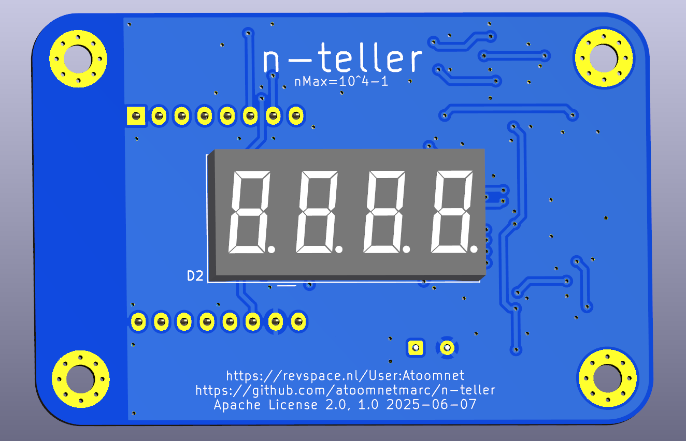
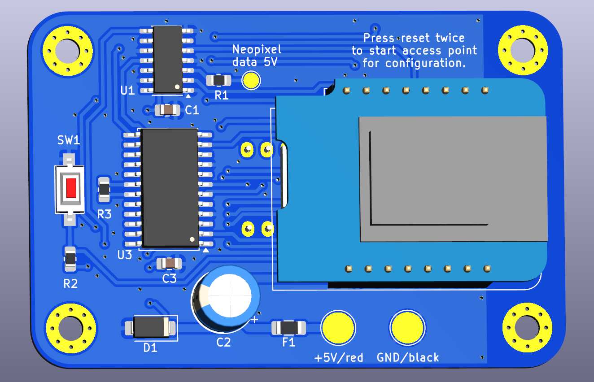
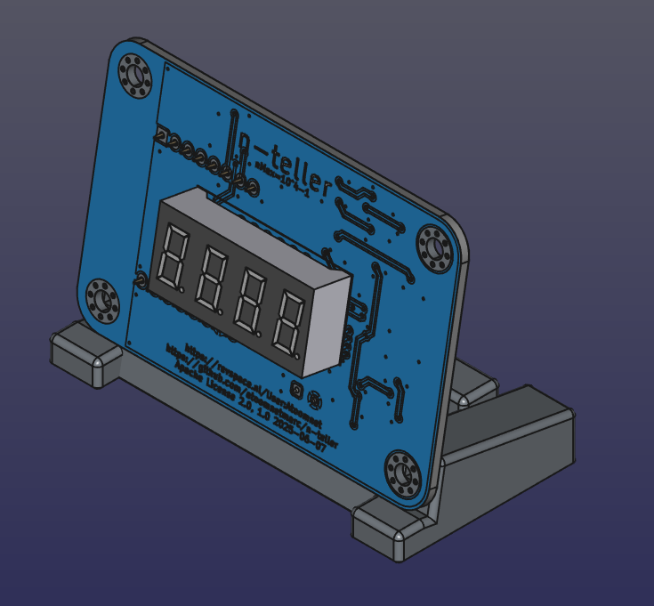

# n-teller

n-teller is an IoT device that displays the number of [checked in participants and visitors](https://revspace.nl/N) at the hackerspace called [Revelation Space (or RevSpace)](https://revspace.nl) .

It connects to the [RevSpace MQTT server](https://revspace.nl/MQTT) via WiFi using an ESP8266.

The MQTT server publishes to [a few topics of interest](https://revspace.nl/MQTT#Topics) that are subscribed:

- revspace/[doorduino](https://revspace.nl/Doorduino3)/checked-in: the is the current total checked people.
- revspace/[state](https://revspace.nl/Spacestatus): the current state (open or closed) of the hackerspace.

# Schematic

[hardware/n-teller-schematic.pdf](hardware/n-teller-schematic.pdf)

# BOM

See interactive BOM: [hardware/bom/](hardware/bom/)

You will also need:

- The pcb. See [hardware/gerber/](hardware/gerber/) for gerber files.
- 2x M3x12 BHCS screws.
- Optional 1x [USB Type-C Female Chassis Connector](USB%20Type-C%20Female%20Chassis%20Connector.jpg).

# Render

# 3d-print

In the [3d](3d/) directory you can find a stand for the pcb.

Print `n-teller-stand-w-usb-c-socket.stl`. This will fit the optional USB Type-C Female Chassis Connector mentioned in the BOM. Or print `n-teller-stand.stl` and role your own connection to 5V power supply.

# Firmware

Compile and flash the firmware located in the [firmware directory](firmware/). You will need [PlatformIO](https://platformio.org/) for this. I recommend installing the [PlatformIO extension for VSCode](https://platformio.org/install/ide?install=vscode).

# Configure WiFi

Double press the reset button (somewhat slowly). The letters `AP` will appear on the display. Now connect to a WiFi network with a name like `nteller-bcddc2895fd2`. Then goto: http://192.168.4.1/ and configure your WiFi.

# Display information

PCB was designed to fit this type (pinout and dimensions) of 0.36" 4-digit 7-segment common cathode LED display:

## Model types

### Tested

These are confirmed working.

- 3461AB, blue

### Untested

These should fit, but are not tested.

- LFD036AAG-101, green
- 3461AG, green
- 3461AGG, jade green
- 3461AS, red
- 3461AW, white
- 3461AY, yellow

